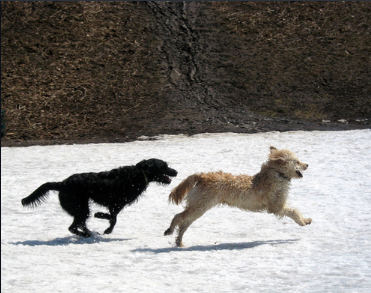
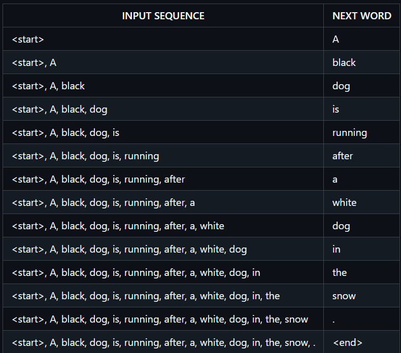
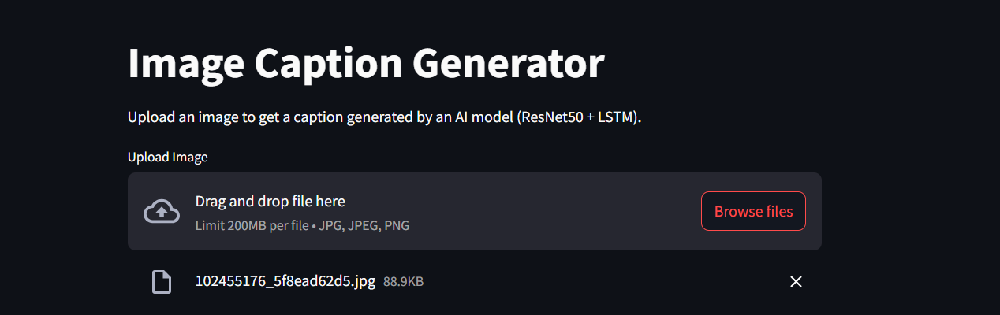
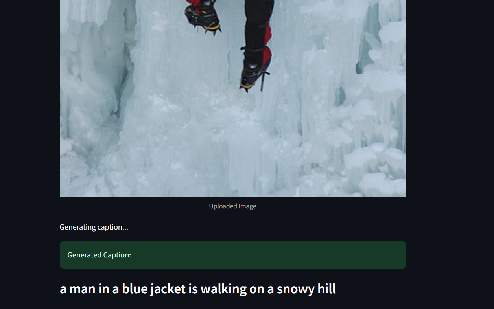
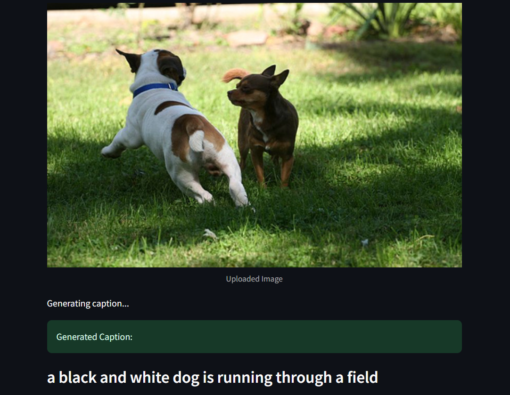

# 🖼️ Image Caption Generator using ResNet50 and LSTM

This project generates natural language captions for input images using a combination of Convolutional Neural Networks (CNNs) and Recurrent Neural Networks (RNNs). It uses **ResNet50** to extract image features and **LSTM** to generate captions word by word.

The model is trained on the **Flickr8k** dataset, which contains 8,000 images each paired with five captions.

---

## 📌 Steps

### 1. Cleaning Captions

- Loaded the `captions.txt` file which contains image names and associated captions.
- Preprocessed captions:
  - Converted to lowercase
  - Removed punctuation and numeric values
  - Removed single character words
  - Added `<start>` and `<end>` tokens to each caption

---

### 2. Feature Extraction using ResNet50

- Used a pre-trained **ResNet50** model (excluding top layers).
- Passed each image through the model and extracted feature vectors of shape `(2048,)`.
- Stored features in a dictionary and saved them to `image_features.pkl`.

---

### 3. Tokenization

- Collected all cleaned captions and created a tokenizer.
- Converted words to integer sequences.
- Calculated maximum caption length.
- Saved tokenizer for future inference.

---

### 4. Creating Input-Output Pairs

- For each caption, created multiple input-output sequences:
  - Input 1: Extracted image feature
  - Input 2: Partial caption sequence (e.g., `<start> a dog`)
  - Output: Next word in sequence (e.g., `is`)
- Padded input sequences to a fixed maximum length.
- Saved processed training arrays as `X1.npy`, `X2.npy`, and `y.npy`.

---

### 5. Model Architecture

The model has two inputs:

- **Image features** (from ResNet50) go through a Dense layer with ReLU.
- **Caption sequences** go through an Embedding layer followed by an LSTM.

Both outputs are merged and passed through a final Dense layer with softmax to predict the next word. The model is trained using categorical cross-entropy and the Adam optimizer.

---

### 6. Training the Model

- Trained the model on **Flickr8k** image-caption pairs
- Saved trained model as `img_caption_model.keras`

---

### 7. Predicting Captions for 1000 Images

- Loaded trained model and tokenizer
- Predicted captions using **greedy search**
- Generated captions for 1000 random images and saved to `predicted_captions_1000.txt`

---

### 8. Evaluation – BLEU Scores

Evaluated the model on test data using BLEU metric:

- **BLEU-1**: `0.43454095627453854`
- **BLEU-2**: `0.2741517607012966`
- **BLEU-3**: `0.1729977913888319`
- **BLEU-4**: `0.11299715211521574`
- **Accuracy** (internal): ~42%

---

## 📌 Notes

The current accuracy and BLEU scores are not very high because:

- The model was only trained for **10 epochs**
- LSTM units were kept low (**128**) for memory efficiency

---

### 🔧 Future Improvements

1. **Train longer** (20–30 epochs) – 10 might be too early.
2. **Increase LSTM units** to 256 or 512 if RAM allows.
3. **Use Beam Search** decoding instead of greedy — this improves BLEU scores.
4. **Add attention mechanism** to help the model focus on relevant image regions.
5. **Use a larger dataset** like Flickr30k or MS COCO for better learning.

---

## 🔁 How It Works (Short Overview)

1. **Image Feature Extraction**

   - A pre-trained CNN (like InceptionV3) extracts features from the input image.

2. **Caption Generation**

   - An LSTM model takes a `<start>` token and generates words one-by-one until `<end>`.

3. **Training Approach**

   - The model learns by predicting the next word in a sequence (as shown in the table).

4. **Full Pipeline**
   - Image → Feature Vector → LSTM Decoder → Word-by-Word Caption → `<end>`

## Some Screenshot of Work

## 📚 References

- [Image Caption Generator using ResNet50 and LSTM by Rupam Goyal](https://github.com/RupamGoyal/Image-Caption-Generator-using-ResNet50-and-LSTM-model)
